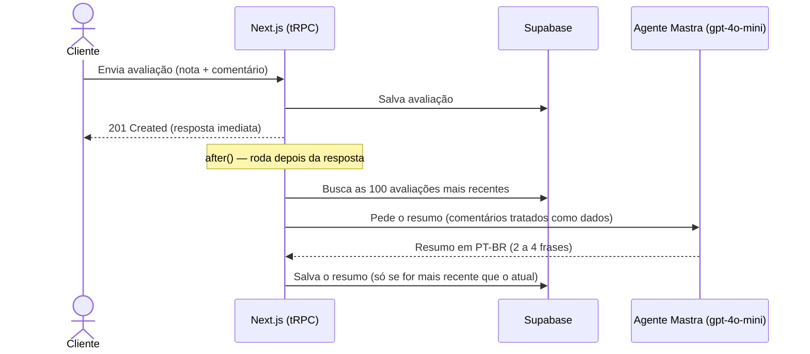
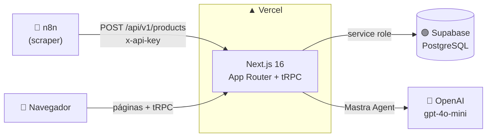

<div align="center">

# ⭐ Avalia.ai

**Plataforma de avaliação de produtos com resumo inteligente das opiniões dos clientes.**

Produtos chegam automaticamente via n8n, clientes avaliam com nota e comentário,
e um agente de IA resume tudo o que foi dito em poucas frases.


</div>

---

## ✨ Funcionalidades

| | Funcionalidade | Descrição |
|---|---|---|
| 🔐 | **Cadastro e login** | Contas com senha em hash (bcrypt) e sessão JWT em cookie HTTP-only, revalidada a cada operação protegida |
| 🛍️ | **Vitrine de produtos** | Home com scroll infinito, paginação por cursor (keyset) e imagens otimizadas com `next/image` |
| ⭐ | **Avaliações** | Nota de 1 a 5 com comentário, média e distribuição das notas atualizadas no banco por trigger |
| 🤖 | **Resumo por IA** | Um agente [Mastra](https://mastra.ai) com `gpt-4o-mini` resume todas as avaliações do produto: pontos fortes, pontos fracos e sentimento geral |
| 🔄 | **Importação automática** | API protegida por chave para o n8n cadastrar produtos (ex.: scraper da Amazon) |
| 📱 | **Responsivo** | Layout pensado para mobile e desktop, com identidade visual índigo/violeta |

## 🧠 Como funciona o Resumo por IA



- O resumo é gerado **a partir de 3 avaliações** e salvo no banco. A página do produto só lê o resumo salvo, sem esperar pela IA.
- Um **update condicional** impede que uma geração antiga sobrescreva uma mais nova quando avaliações chegam ao mesmo tempo.
- As instruções do agente protegem contra **prompt injection**: pedidos escritos dentro dos comentários são ignorados.
- Se a OpenAI falhar, o erro vai para o log e o resumo anterior continua visível.

## 🏗️ Arquitetura



O front e a API vivem no mesmo app Next.js. A lógica fica nas **procedures tRPC**, usadas diretamente pelo front e pelos Server Components. Os endpoints REST em `/api/v1` são uma camada fina que chama as mesmas procedures, com a mesma validação **Zod** compartilhada entre front e back.

## 🧰 Stack

**Front-end:** Next.js 16 (App Router) · React 19 · Tailwind CSS 4 · shadcn/ui (Base UI) · React Hook Form · TanStack Query · date-fns · Lucide

**Back-end:** tRPC 11 · Zod 4 · Supabase (PostgreSQL) · bcrypt · jose (JWT) · Mastra (`@mastra/core`)

**Ferramentas:** Bun · Biome (lint + format) · TypeScript

**Infra:** Vercel · Supabase Cloud · n8n

## 🚀 Rodando localmente

### Pré-requisitos

- [Bun](https://bun.sh) 1.4+
- Um projeto no [Supabase](https://supabase.com)
- Uma chave da [OpenAI](https://platform.openai.com/api-keys) (para o Resumo por IA)
- n8n rodando localmente ou acesso à API do n8n

### 1. Instale as dependências

```bash
bun install
```

### 2. Configure as variáveis de ambiente

```bash
cp .env.example .env.local
```

| Variável | Descrição |
|---|---|
| `NEXT_PUBLIC_SUPABASE_URL` | URL do projeto (Supabase → Project Settings → API) |
| `SUPABASE_SERVICE_ROLE_KEY` | Chave *service role*: só é usada no servidor |
| `SESSION_SECRET` | Segredo do JWT da sessão: `openssl rand -base64 32` |
| `ADMIN_API_KEY` | Chave exigida no header `x-api-key` para cadastrar produtos: `openssl rand -hex 32` |
| `OPENAI_API_KEY` | Chave da OpenAI usada pelo agente Mastra |

### 3. Crie o banco

Rode as migrations de [`supabase/migrations`](./supabase/migrations) **em ordem** no SQL Editor do Supabase (ou com `supabase db push`):

```
20261001000329_create_accounts.sql
20261001120000_create_products.sql
20261001120100_create_products_feedbacks.sql
20261001150000_lock_product_score_refresh.sql
20261001160000_add_product_ai_summary.sql
```

### 4. Suba o servidor

```bash
bun run dev
```

Acesse **http://localhost:3000** 🎉

### Scripts

| Comando | O que faz |
|---|---|
| `bun run dev` | Servidor de desenvolvimento |
| `bun run build` | Build de produção |
| `bun run start` | Sobe o build de produção |
| `bun run lint` | Lint e checagem de formatação (Biome) |
| `bun run format` | Formata o código |
| `bun --conditions=react-server --env-file=.env.local scripts/backfill-ai-summaries.ts` | Gera resumos de IA para produtos que já têm avaliações |

## 📡 API REST

Todas as rotas aceitam e retornam JSON. Erros seguem o formato:

```json
{ "error": { "code": "BAD_REQUEST", "message": "Dados inválidos.", "fieldErrors": { "name": ["..."] } } }
```

| Método | Rota | Auth | Descrição |
|---|---|---|---|
| `POST` | `/api/v1/sign-up` | — | Cria uma conta |
| `POST` | `/api/v1/sign-in` | — | Faz login e define o cookie de sessão |
| `GET` | `/api/v1/products?cursor=&limit=` | — | Lista produtos paginados (`{ items, nextCursor }`) |
| `POST` | `/api/v1/products` | 🔑 `x-api-key` | Cadastra um produto |
| `GET` | `/api/v1/products/:id/feedbacks` | — | Lista as avaliações do produto |
| `POST` | `/api/v1/products/:id/feedbacks` | 🍪 sessão | Envia uma avaliação |

<details>
<summary><b>Exemplo: cadastrar um produto (n8n)</b></summary>

```bash
curl -X POST https://seu-app.vercel.app/api/v1/products \
  -H "Content-Type: application/json" \
  -H "x-api-key: $ADMIN_API_KEY" \
  -d '{
    "name": "Echo Dot (5ª Geração)",
    "url": "https://www.amazon.com.br/dp/B09B8V1LZ3",
    "image": "https://m.media-amazon.com/images/I/71xoR4A6q-L.jpg"
  }'
```

- `name`: até 300 caracteres
- `url` (ou `external_link`): link http/https do produto
- `image`: URL https de um host permitido (`images.unsplash.com`, `m.media-amazon.com`). Para liberar outro host, edite [`src/lib/image-hosts.ts`](./src/lib/image-hosts.ts)
- `description`: opcional
- Campos extras (como `asin` e `price`) são ignorados

**Respostas:** `201` criado · `400` validação · `401` chave ausente ou inválida

</details>

<details>
<summary><b>Exemplo: criar conta, entrar e avaliar</b></summary>

```bash
# Criar conta (senha com no mínimo 8 caracteres)
curl -X POST http://localhost:3000/api/v1/sign-up \
  -H "Content-Type: application/json" \
  -d '{"firstName":"Ana","lastName":"Souza","email":"ana@email.com","password":"minhasenha","confirmPassword":"minhasenha"}'

# Entrar (salva o cookie de sessão)
curl -c cookies.txt -X POST http://localhost:3000/api/v1/sign-in \
  -H "Content-Type: application/json" \
  -d '{"email":"ana@email.com","password":"minhasenha"}'

# Avaliar um produto
curl -b cookies.txt -X POST http://localhost:3000/api/v1/products/<id>/feedbacks \
  -H "Content-Type: application/json" \
  -d '{"score":5,"comment":"Produto excelente, chegou antes do prazo!"}'
```

</details>

## 🗂️ Estrutura do projeto

```
src/
├── app/
│   ├── (platform)/            # Home e página do produto (header compartilhado)
│   │   └── products/[id]/     # Detalhe, avaliações e card do Resumo por IA
│   ├── auth/                  # Telas de cadastro e login
│   └── api/
│       ├── trpc/[trpc]/       # Handler do tRPC
│       └── v1/                # Endpoints REST (camada fina sobre o tRPC)
├── components/                # Componentes compartilhados + shadcn/ui
├── lib/
│   └── validation/            # Schemas Zod compartilhados entre front e back
├── server/
│   ├── ai/                    # Agente Mastra e geração do resumo
│   ├── routers/               # Procedures tRPC (auth, products, feedbacks)
│   ├── db.ts                  # Cliente Supabase (service role, só no servidor)
│   └── session.ts             # Sessão JWT em cookie HTTP-only
└── trpc/                      # Cliente tRPC + React Query
supabase/migrations/           # Schema do banco
scripts/                       # Scripts utilitários (backfill de resumos)
specs/ · docs/                 # Especificações e planos de cada feature
```

## 🔒 Segurança

- Senhas com **bcrypt**; e-mail e senha nunca saem do banco nas respostas da API
- Sessão em **cookie HTTP-only** (`secure` em produção), revalidada no banco a cada operação protegida
- Cadastro de produtos protegido por **`x-api-key`**, com comparação em tempo constante e recusa total se a chave não estiver configurada
- As rotas de conta e de avaliação exigem `Content-Type: application/json`, o que bloqueia CSRF via formulário
- **RLS ativo** em todas as tabelas: só o servidor (service role) acessa os dados
- Imagens restritas a uma **allowlist de hosts**, para o `/_next/image` não virar proxy aberto
- Cursor de paginação validado com regex estrita antes de entrar na query

## ☁️ Deploy na Vercel

1. Importe o repositório na [Vercel](https://vercel.com/new). O Bun é detectado automaticamente pelo `bun.lock`
2. Em **Settings → Environment Variables**, cadastre as variáveis do `.env.example`. Use valores **novos** para `SESSION_SECRET` e `ADMIN_API_KEY`
3. Faça o deploy (ou um **Redeploy**, se as variáveis forem adicionadas depois)
4. No n8n, aponte o node HTTP Request para `https://seu-app.vercel.app/api/v1/products` e envie o header `x-api-key` (de preferência por uma Credential do tipo *Header Auth*)

---

<div align="center">

Feito com 💜 usando Next.js, Supabase e Mastra

</div>
